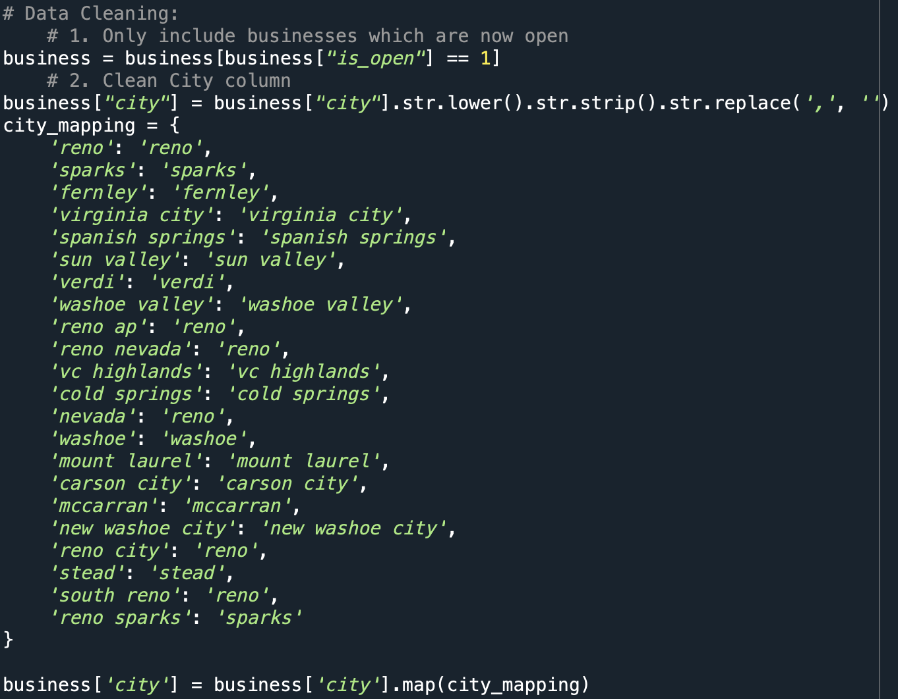

# Final Project Proposal

**GitHub Repo URL**:  https://github.com/CMU-IDS-Spring-2024/final-project-team3

A short summary (3-4 paragraphs, about one page) of the data science problem you are addressing and what your solution will address. Feel free to include a figure or sketch to illustrate your project.

Each group should submit the URL pointing to this document on your GitHub repo.

**Team members:**

- Xuye He: xuyeh@andrew.cmu.edu
- Xiangyu Bao: xiangyub@andrew.cmu.edu
- Jiaying Qian: jiayingq@andrew.cmu.edu
- Alex Yang: yihsuehy@andrew.cmu.edu

---

### Description of the data problem 

In today's dynamic culinary landscape, navigating the myriad of dining options poses a challenge for consumers and business owners. Customers often struggle to discern which areas host specific types of popular restaurants and where to find establishments with the most favorable reviews. Simultaneously, business owners face the daunting task of identifying optimal locations to establish new ventures while understanding the competitive landscape and prevailing consumer preferences.

Leveraging the comprehensive Yelp database, we aim to tackle these challenges head-on by providing customers and business owners with actionable insights. Our mission is to empower consumers with knowledge about the culinary scene in various regions, enabling informed dining decisions. Likewise, we strive to equip business owners with valuable information regarding lucrative locations for new restaurant ventures and essential business insights about those areas.

Through our data-driven approach, utilizing advanced data visualization techniques, we endeavor to bridge the gap between consumers and businesses, enhancing the dining experience and fostering growth within the restaurant industry.

We intend to design our interactive dashboards with the following structure:

_**2 Pages targeting users:**_

- Business Explorer Page:
Allow users to search for businesses based on location, category, or specific criteria like review score.
Display summary statistics about businesses, such as average star rating, and review count. 
Provide interactive visualizations, such as maps or histograms, to showcase the distribution of businesses by category or location.
- Review Analysis Page:
Enable users to explore reviews for individual businesses or across categories.
Show sentiment analysis of reviews to highlight positive and negative feedback.

**_2 Pages targeting business:_**

- Food Preference Page: 
	- Allow Yelp to understand the food preferences of each location
	- Facilitate marketing activities in deciding when and what to promote
	- Heatmap showing ratings at different locations filtered by category
	- Include tips for another heatmap, provide more evidence for Yelp to recognize 		the taste of customers
	- Data Required:
		- User Ratings on Business
		- Business Category
		- Geolocation
		- tip
- Check-in Heatmap Page:
	- Analyze time-series data of customers’ check-ins alongside geographical data
	- Allow business owners to view check-in time & density for their owned businesses to determine the amount of service needed at each time
	- Allow business owners to view regional statistics, including time & number of customers at peak/low points to determine the best opening hours
- Predictive Modeling in Check-in Numbers for potential new business owners
	- We will provide a Number of Check-in prediction to the business owner who want to open a restaurant in that new area with the data provided by the owner (type, restaurant info, location, etc. ) and all the restaurant in that area, to predict how many checkins the new owner could have when the restaurant is opened. 

### Datasets
  1. Main: A subset of Yelp Open Dataset(https://www.yelp.com/dataset), since the full dataset is too large, we instead filter a subset that includes only businesses in Nevada.
  
  2. Other data to augment: Our datasets are quite rich and contain information like business, user, review, check-in, etc, which are enough to answer most of our questions. Therefore, we are not considering adding other data sources at this stage. 
 
---

## Phase 2: Sketches and Data Analysis
  1. Data Processing: Do you have to do substantial data cleanup? What quantities do you plan to derive from your data? How will data processing be implemented?  Show some screenshots of your data to demonstrate you have explored it

Due to the completeness of our dataset, there is no substantial data cleaning that we will have to perform, however, we would have to filter a subset to include only the businesses in Nevada to keep the dataset relatively small and making sure it can run smoothly on our Streamlit app.

*Data Cleaning for the Business data*

*Checking for NAs*

*Filtering for Review Dataframe*

*Filtering for Tips Dataframe*

*Histogram of the Distribution of stars*

  
  2. System Design: How will you display your data? What types of interactions will you support? Provide some sketches that you have for the system design.

We will display our graphs mainly in heatmaps showcasing different values in the actual geolocation supplement with some filters like sliders and selections.

**Sketches**

1. Drawing Review Page
   
  
  
2. Food Preference Page

  

3. Check-in Heatmap Page

  
  
4. User Business Explore Page

  
   This sketch only shows the potential functionality of the page. The photo file will be combined with the business data set to provide with customers with pictures and highlights of the business they are interested in. In addition, more filters like specific hours will be added. The design and interactivity are also intended to be improved in the future version.
   

  

